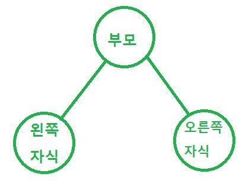
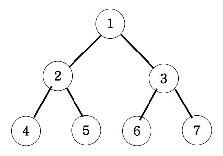
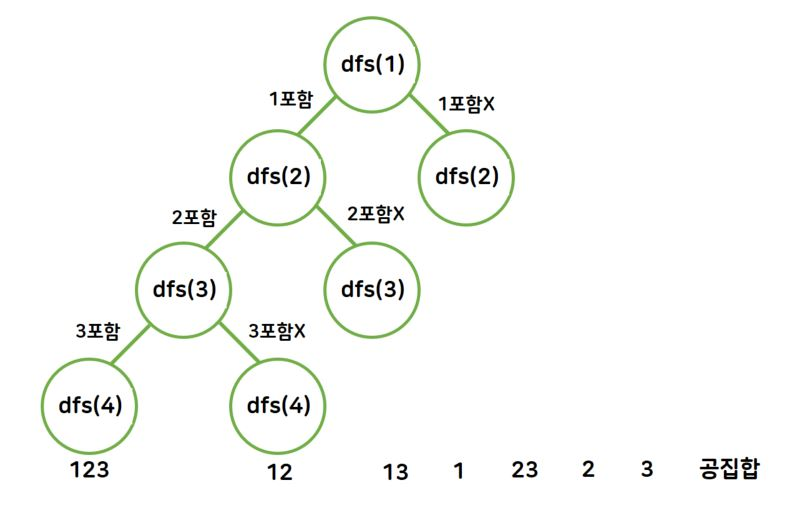

# dfs로 이진트리 구현하기

- 보통 한다/안한다의 문제는 'dfs'로 풀 수 있음
- 단, n이 30이상?처럼 n이 큰 경우에는 DP로 풀어야함

## 기본구조

;

## 트리

- 트리의 순회 방법은 총 3가지가 있다. 아래의 그림으로 순회 방법을 알아보자.

;

### 1. 전위순회

- 탐색순서: (부모) → (왼쪽) → (오른쪽)
- 1 → 2 → 4 → 5 → 3 → 6 → 7

```js
function solution(v) {
  let answer;
  function dfs(v) {
    if (v > 7) {
      return;
    } else {
      console.log(v); // 이 지점에서 부모를 출력하면 전위순회
      dfs(v * 2); // 왼쪽자식으로 넘어감
      dfs(v * 2 + 1); // 오른쪽자식으로 넘어감
    }
  }
  dfs(v);
  return answer;
}

console.log(solution(1)); // v는 부모 노드를 의미함 (넘어온 건 부모)
```

### 2. 중위순회

- 탐색순서: (왼쪽) → (부모) → (오른쪽)
- 4 → 2 → 5 → 1 → 6 → 3 → 7

```js
function dfs(v) {
  if (v > 7) {
    return;
  } else {
    dfs(v * 2);
    console.log(v); // 이 지점에서 부모를 출력하면 중위순회
    dfs(v * 2 + 1);
  }
}
```

### 3. 후위순회

- 탐색순서: (왼쪽) → (오른쪽) → (부모)
- 4 → 5 → 2 → 6 → 7 → 3 → 1

```js
function dfs(v) {
  if (v > 7) {
    return;
  } else {
    dfs(v * 2);
    dfs(v * 2 + 1);
    console.log(v); // 이 지점에서 부모를 출력하면 후위순회
  }
}
```

# dfs로 부분집합 구하기

## 부분집합

- 부분집합이란 두 집합 A, B에서 집합A의 원소가 집합 B에 포함될 때, A를 B의 부분집합이라고 부르고 `A⊂B` 라고 나타낸다.
- 1이 모든 수의 약수인 것처럼 공집합 ∅은 모든 집합의 부분집합이다.
- 모든 수가 자기 자신을 약수로 갖는 것처럼, 집합에서도 자기 자신을 부분집합으로 가진다.

## 부분집합의 개수 구하는 방법

### 1. 원소의 개수를 0개부터 1개씩 늘려가면서 구하는 방법

A = {1, 2, 3}

1. 원소의 개수가 0개인 부분집합: 공집합
2. 원소의 개수가 1개인 부분집합: {1}, {2}, {3}
3. 원소의 개수가 2개인 부분집합: {1, 2}, {1, 3}, {2, 3}
4. 원소의 개수가 3개인 부분집합: {1, 2, 3}

- 이렇게 구하는 방법도 있지만, 이는 너무 비효율적이므로 '경우의 수'를 사용한다.

<br>

### 2. 경우의 수로 구하는 방법

1. A의 부분집합에는 1을 포함하거나, 포함하지 않는 두 가지 경우가 있다.
2. 또한 2와 3도 포함하거나, 포함하지 않는 경우가 있다.
3. 원소별로 2가지씩 경우의 수가 생기며, 이는 `동시에 발생하는 사건`이니 곱의 법칙으로 표현한다.
4. 즉, `(1의 경우)2 * (2의 경우)2 * (3의 경우)3 = 8`로 총 8가지의 경우가 생긴다.

> 집합 A의 원소의 개수가 n개일 때, 집합 A의 부분집합의 개수는 2^n

## 트리로 그려보기



# 순열

- 서로 다른 n개의 원소에서 r개를 중복없이 순서에 상관있게 선택 or 나열하는 것 (nPr)
- n개의 항목 중 r개를 선택하여 줄을 세우는 것
- 조합과 달리 **순서대로 뽑아서 나열하는 것**이 핵심
  - 때문에 1,2와 2,1은 다름
- nPr = n _ (n-1) _ (n-2) _ ... _ (n-r+1)
  - ex) 4P3 = 4 _ 3 _ 2 = 24
  - ex) 5P5 = 5! = 5 _ 4 _ 3 _ 2 _ 1 = 120
- 예외 경우
  - nPn = n!
  - nP0 = 1

## 팩토리얼과 계승

- 순열의 한 부분으로 nPr에서 r = n이면 nPn이 되고, 이는 다음과 같음
  - nPn = n _ (n-1) _ (n-2) _ ... _ 3 _ 2 _ 1
- 거꾸로 보면 1부터 n까지 곱하게 되며 이를 **`계승`** 이라고 하고 기호로 **`n!`** 로 나타냄
- 이를 **팩토리얼**이라고 함
- r=0이면 nP0. **`nP0 = 1`**;

# 조합 (Combination)

- 서로 다른 n개에서 순서와 상관없이 r개를 고르는 것
  - 순열과 달리 순서가 중요하지 않고, 그냥 r개를 고르기만 하면 됨
- **nCr = nPr / r!**: 조합은 순열과 팩토리얼을 이용해서 나타낼 수 있음
  - r은 개수이므로 0 < r <= n 이어야함
  - nCr = n-1Cr-1 + n-1Cr
    - ex) 5C3이라고 했을 때, 5C3은 4C2 + 4C3과 같음.
    - 5를 기준으로 생각했을 때
    - 4C2(n-1Cr-1)은 5를 반드시 포함하고 남은 4가지 수에서 2개를 뽑는 경우의 수와 같고,
    - 4C3(n-1Cr)은 5를 포함하지 않고 남은 4가지 수 중에서 3개를 뽑는 경우의 수와 같음
- 예외 경우
  - nCn = 1
  - nC0 = 1

# [python] dfs

## 기본 방문 방법

```py
def dfs(nowNode):
  if nowNode is None:
    return
  dfs(nowNode.left) # 재귀
  dfs(nowNode.right) # 재귀

dfs(root)
```

## 3가지 순회 방법

### 1. 전위 순회 (PreOrder)

- visited: root => left => right

```py
def preorder(nowNode):
  if nowNode is None:
    return

  print(nowNode.value) # 자손에 접근하기 전에 방문부터 한다.
  preorder(nowNode.left)
  preorder(nowNode.right)
```

### 2. 중위 순회 (InOrder)

- visited: left => root => right

```py
def inorder(nowNode):
  if nowNode is None:
    return

  inorder(nowNode.left)
  print(nowNode.value) # 방문
  inorder(nowNode.right)
```

### 3. 후위 순회 (P ostOrder)

- visited: left => right => root

```py
def postorder(nowNode):
  if nowNode is None:
    return

  postorder(nowNode.left) # 자식노드부터 모두 방문한 뒤에
  postorder(nowNode.right)
  print(nowNode.value) # 자기 자신을 방문
```
